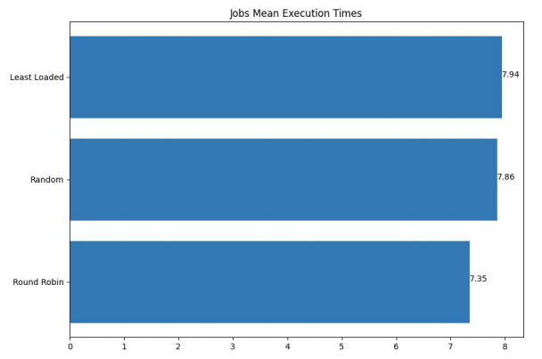

# Yet Another Centralized Scheduler
YACS - Yet Another Centralized Scheduler
This repository contains the final project for the Big Data (UE18CS322) course for the 5th Semester.

---

## Introduction
the goal of this project is to construct a
framework which follows the master-slave design. The framework consists of 1 master and 3 workers. The master process takes care of the scheduling decisions of the workers and
monitors the communication to keep the entirety in sync.

---

## Workflow
**Master Workflow**

---

**Worker Workflow**

---

## Design
We have used the following data structures to assist us in processing the jobs in the
master:
- workers_state: A nested dictionary indexed by the worker_id which has the information about the worker such as the port number, and the number ofoccupied slots as well as the total number of slots.
- map_jobs_tbd: A list of dictionaries which contain all the map jobs to be done. It contains the details about the duration of the task and the id.
- reduce_jobs_tbd: A list of dictionaries which contain all the reduce jobs to be done. It contains the details about the duration of the task and the id. It is populated only when the corresponding map jobs are completed
-  job_state: A dictionary indexed by job_id which contains the information about each job such as the map and reduce tasks as well as the completed tasks. It also contains the arrival time and completion time.

Each of these variables are shared across the master threads using a lock for each variable to ensure that there is no multiple access to maintain consistency.

The worker shares one variable across both its threads that is the **task_tbd** It is list of dictionaries which contain all the tasks that the worker has to execute.

This variable is also shared across both worker threads using a lock to maintain
consistency.

---

## Results and Visualizations
The below heatmaps gives us the distribution of the tasks across the workers across time.

---

Mean and Median of the execution time with respect to the Jobs

---

Mean and Median of the execution time with respect to the tasks

---

## Execution Instructions
Terminal 1: python3 master.py path_to_config.json algorithm_type('RR','RANDOM','LL')  

Terminal 2: python3 worker.py port worker_id

The above ^ has to be repeated based on the config file provided. The process can be automated however this assumes all workers would run on the same system and not on different ones. The communication between master and worker is done using localhost however if it is on different systems the IP address must be set appropriately.

Terminal Last: python3 requests.py number_of_requests 

Two log files are created for each algorithm and after the files have been created for **all** algorithms analysis.py can be run to obtain the visualizations.

python3 analysis.py

Modules utilized for the visualizations:
* math
* pandas 
* matplotlib.pyplot 
* numpy 

Modules utilized for Master and Worker:
* os
* sys
* csv
* json
* copy
* socket
* random
* threading
* time 
